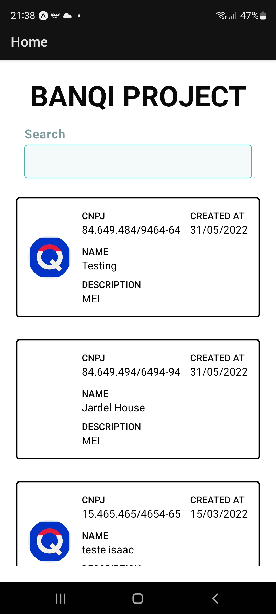
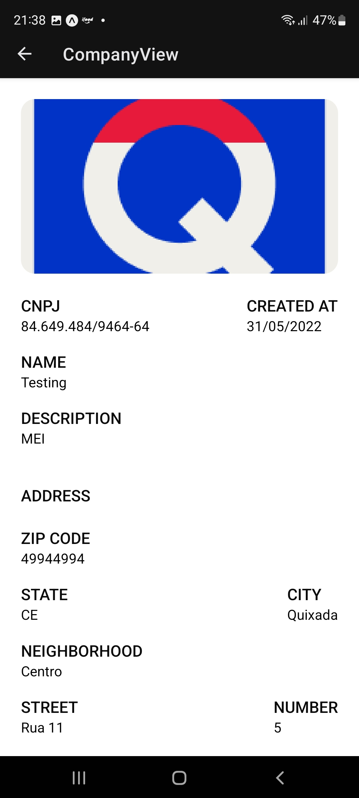

# XPTO Company | React Native

XPTO company wants to create a banQi account. You have to provide a way to make that account.

## Description

I managed to work only with those below:

* Get a company
* List all companies

The api to be consumed is <https://banqi-pj-challenge.herokuapp.com/companies/>.

The grading of the app  will be based on three criteria:

* 20% - Atomic commits / Good commit messages
* 30% - Tests
* 30% - Overall Design and Structure
* 20%  - Good README

## Screenshots

List Filter View             |  Edit View
:-------------------------:|:-------------------------:
  |  

## Getting Started

### Dependencies

* Node latest version
* Expo CLI

### Installing

* How/where to download your program
* Any modifications needed to be made to files/folders

### Executing program

* How to run the program
* Step-by-step bullets

```
1. npm install or yarn install
2. npm tests
3. npm start
4. Use a mobile phone with expo
```

## Help

Any advise for common problems or issues.

```
There is a known issue in the expo repository about the @types/react dependency. The types for the JSX Component have been working properly, I solved these issue putting the __resolutions__ object in the package.json. However, in case met any issue, this is where there is some discussions about it:

(https://github.com/expo/expo-cli/issues/4329)
```

## Authors

Contributors names and contact info

Dheyson Alves
[@dheysonlalves](https://twitter.com/dheysonlalves)

## License

This project is licensed under the [NAME HERE] License - see the LICENSE.md file for details
